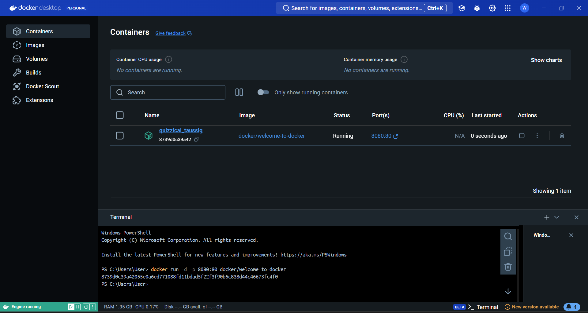
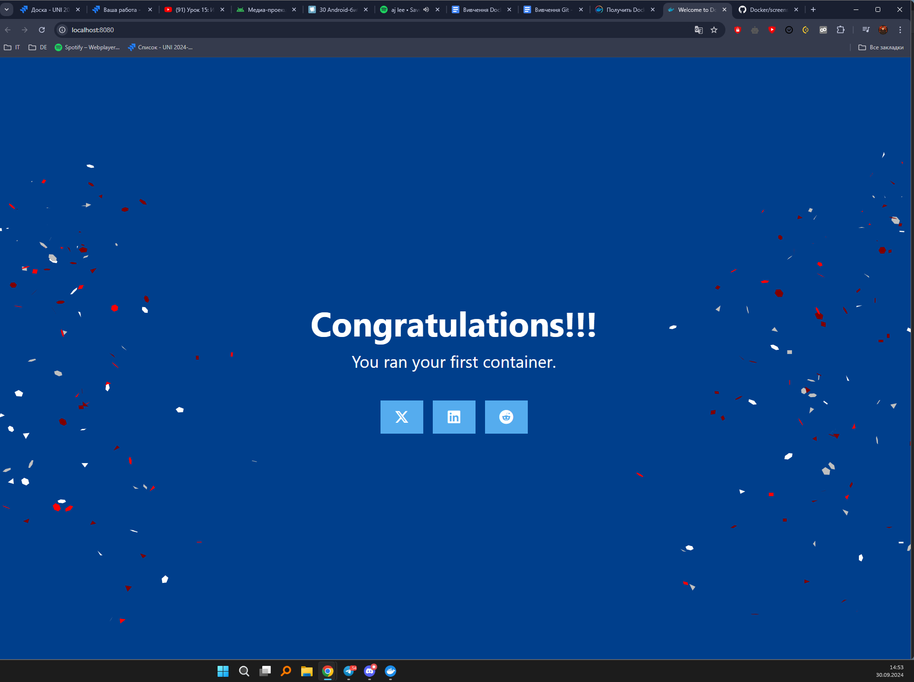
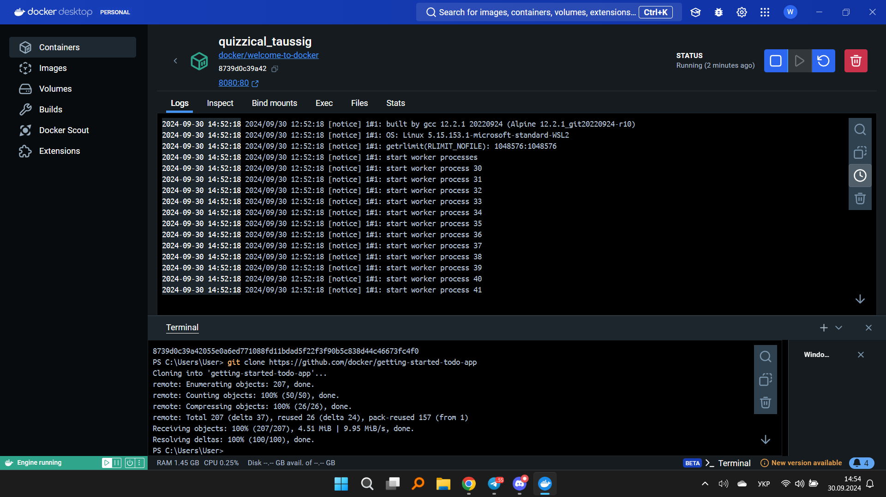
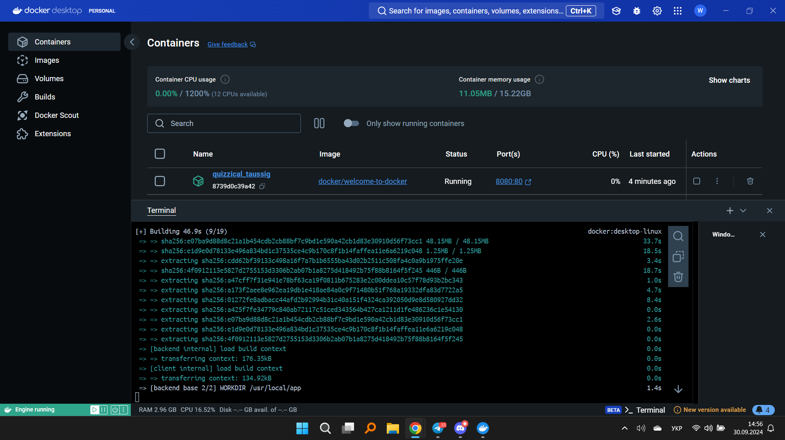
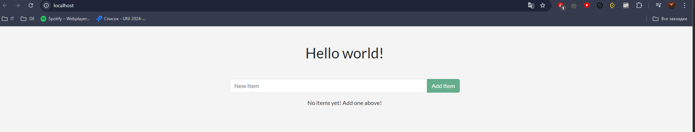
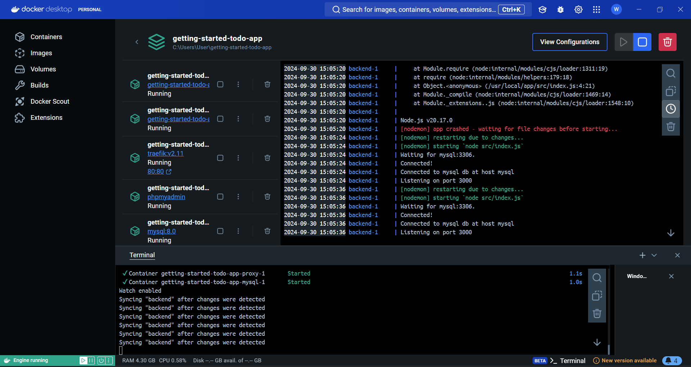
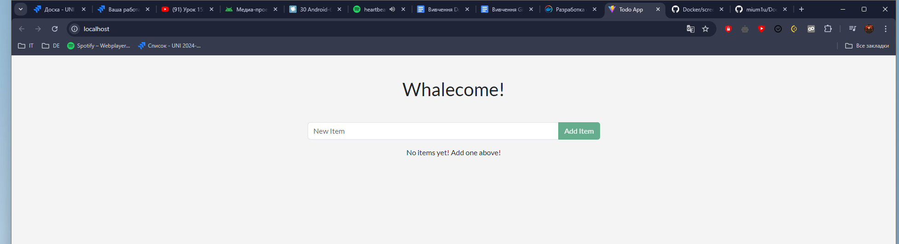
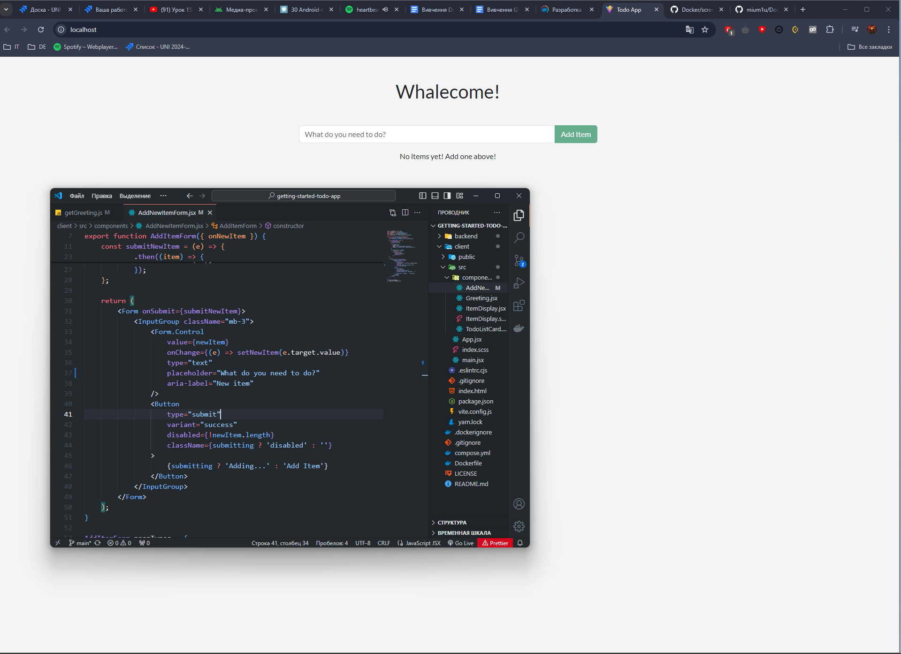
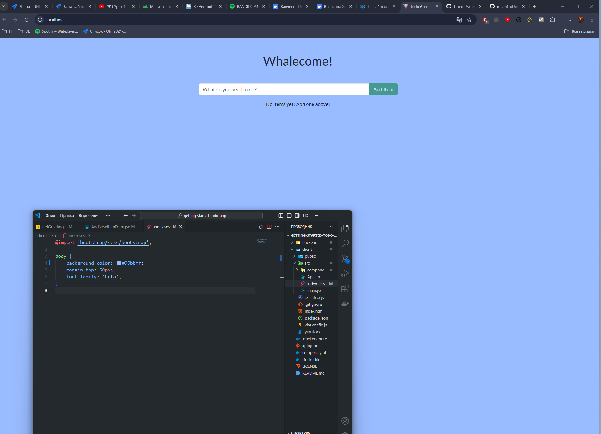

[docker](https://docs.docker.com/get-started/)
## Виконано
### Запуск першого контейнера

### Доступ до інтерфейсу

### Перегляд інформації про контейнер

### Запуск проекту за допомогою CLI

### Проект успішно запустився

### Зміна коду у файлі getGreeting.js

### Зміни відразу відображаються на сторінці

### Зміна placeholder

### Зміна фону сторінки

